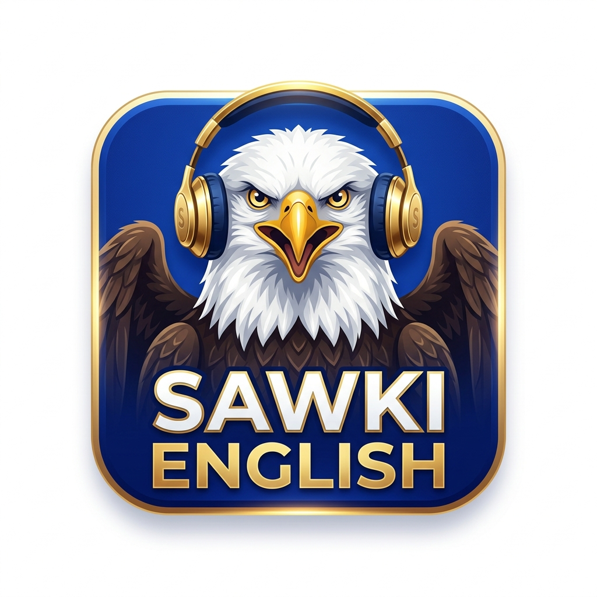

# 🎓 Sawki English

<p align="center">
  
</p>

<p align="center">
  <strong>L'application d'apprentissage d'anglais américain accéléré avec Tuteur IA et reconnaissance vocale.</strong><br>
  <em>Éditée par <strong>Sawki Group</strong> (Ibrahim Moudy Ibrahima)</em>
</p>

<p align="center">
  
  
  
  
  
</p>

---

## 🌟 Présentation

**Sawki English** est une application mobile d'anglais américain conçue pour les apprenants francophones. Elle allie la rigueur du Cadre Européen Commun de Référence pour les Langues (**CECRL**) avec la puissance de l'Intelligence Artificielle générative (**Google Gemini**) et de la reconnaissance vocale avancée.

### 🚀 Fonctionnalités Clés
- **Cursus 120 Leçons (A0 à C1) :** 6 paliers d'apprentissage progressif avec 20 leçons structurées par niveau (vocabulaire, grammaire, dictées et mise en situation).
- **Tuteur Vocal IA Sarah (Gemini 3.6 Flash) :** Conversation bilingue en temps réel avec correction bienveillante, explications pédagogiques en français et moteur de secours hors-ligne.
- **Atelier de Prononciation & Dictée :** Évaluation fine au microphone (Speech-to-Text) avec feedback phonétique instantané.
- **Grand Examen de Maîtrise & Certification :** 30 questions de haut niveau avec délivrance d'un Diplôme officiel Sawki partageable.
- **Mode Sombre & Clair :** Interface soignée avec boutons 3D tactiles et contraste optimisé pour un confort de lecture optimal.
- **Synchronisation Cloud & Clé Sawki :** Sauvegarde sécurisée chiffrée via Supabase et clé de restauration portative.

---

## 🛠️ Stack Technique

| Composant | Technologie |
| :--- | :--- |
| **Framework** | [Flutter](https://flutter.dev) (SDK ^3.11.5) |
| **Langage** | [Dart](https://dart.dev) |
| **State Management** | Provider |
| **Persistance Locale** | Hive (Boxes chiffrées & indexées) |
| **Cloud Sync** | Supabase REST API (TLS chiffré) |
| **Intelligence Artificielle** | Google Gemini 3.6 Flash API |
| **Synthèse Vocale (TTS)** | Google Cloud Text-to-Speech & Flutter TTS |
| **Reconnaissance Vocale** | Speech-to-Text Android natif |
| **Monétisation** | Google AdMob (Bannières & Vidéos Récompensées) |

---

## 🔒 Confidentialité & RGPD

Sawki English respecte la vie privée de ses utilisateurs :
- **Aucun enregistrement vocal stocké :** Le flux microphone est analysé en mémoire vive en temps réel et n'est jamais sauvegardé.
- **Politique de confidentialité officielle :** [Consulter la Politique de Confidentialité](https://raoulib.github.io/sawki-english/)

---

## 🚀 Compilation & Lancement

### Lancer en mode développement avec injection des clés :
```bash
flutter run \
  --dart-define=GEMINI_API_KEY=votre_cle_gemini \
  --dart-define=SUPABASE_URL=votre_url_supabase \
  --dart-define=SUPABASE_ANON_KEY=votre_cle_anon_supabase
```

### Compiler le bundle pour le Google Play Store :
```bash
flutter build appbundle --release \
  --dart-define=GEMINI_API_KEY=... \
  --dart-define=SUPABASE_URL=... \
  --dart-define=SUPABASE_ANON_KEY=...
```

---

## 🏢 Éditeur

**Sawki Group**  
Fondateur : Ibrahim Moudy Ibrahima  
Contact : `contact@sawkigroup.com`  
Copyright © 2026 Sawki Group. Tous droits réservés.
